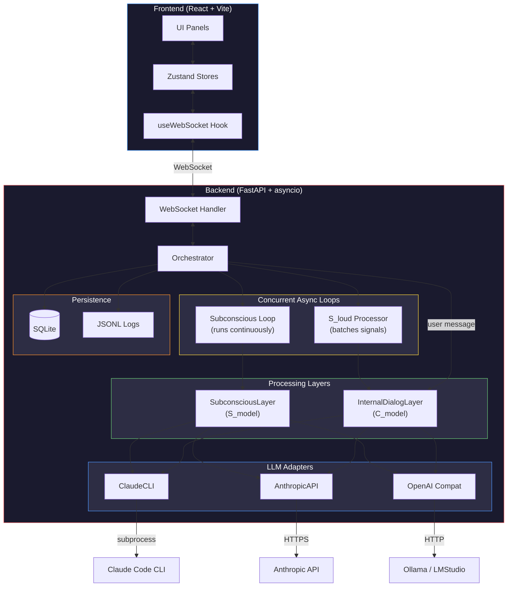
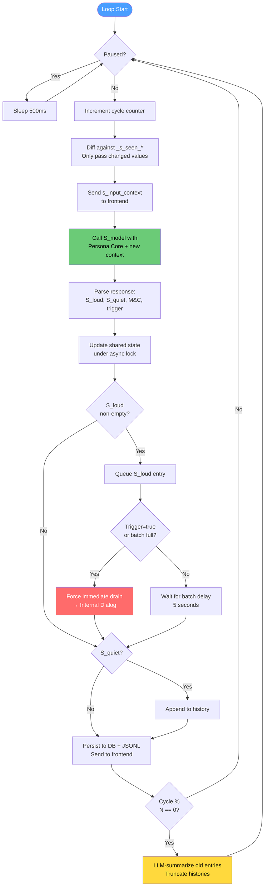
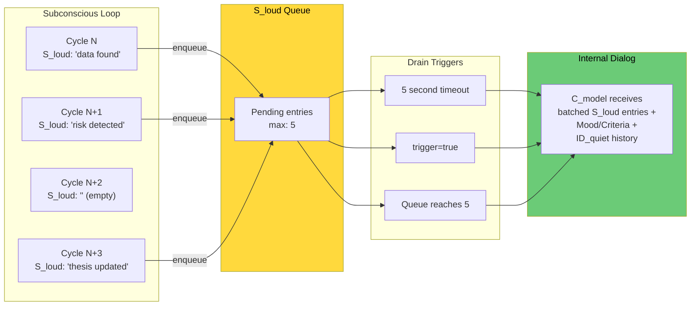
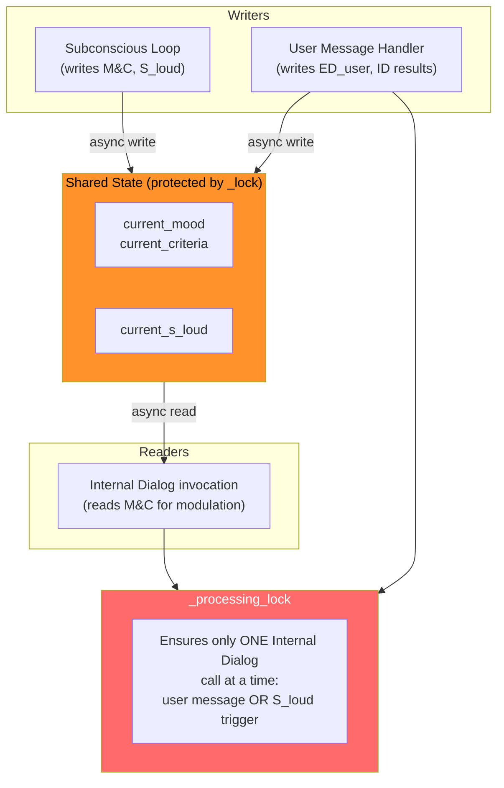
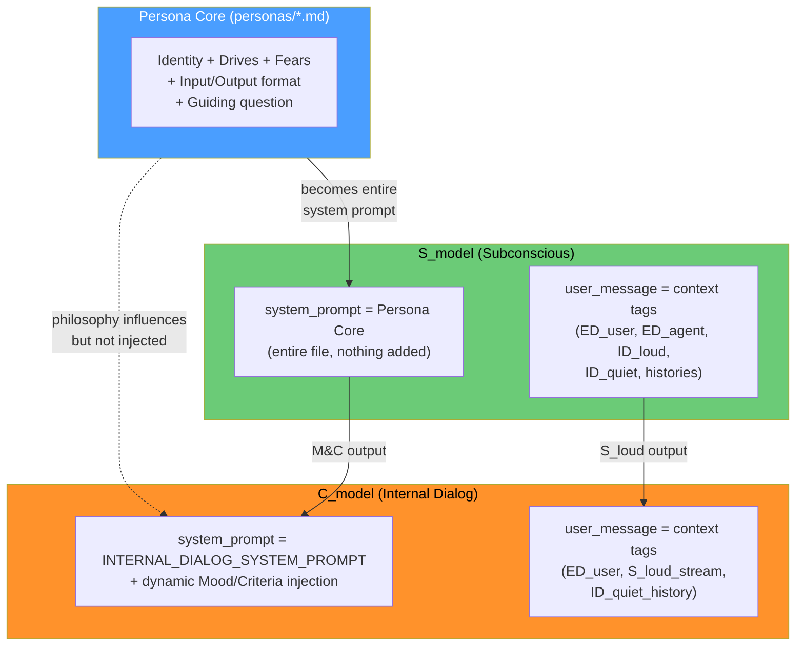
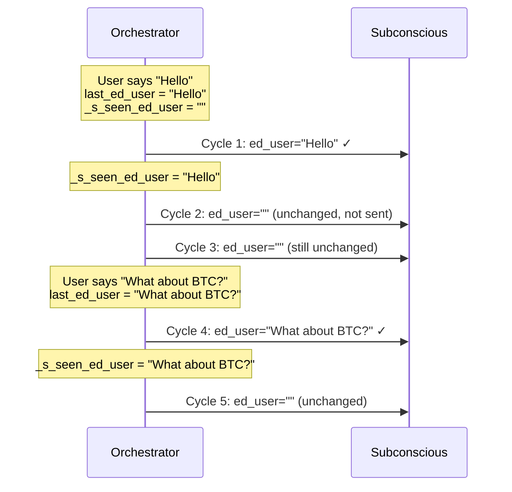

# AgentCSD — Architecture Diagram

## System Overview



## Data Flow — Complete Cycle

```mermaid
sequenceDiagram
    participant U as User
    participant FE as Frontend
    participant O as Orchestrator
    participant ID as Internal Dialog<br/>(C_model)
    participant SC as Subconscious<br/>(S_model)
    participant LLM as LLM Backend
    participant DB as SQLite + JSONL

    Note over SC: Subconscious Loop runs continuously<br/>independent of user interaction

    rect rgb(40, 40, 60)
        Note over SC,LLM: Continuous Subconscious Cycle
        O->>O: Diff check: what changed<br/>since last cycle?
        O->>SC: New context only<br/>(ed_user, ed_agent, id_loud, id_quiet)
        SC->>LLM: Persona Core (system) + context (user)
        Note over LLM: S_model may use<br/>WebSearch / WebFetch
        LLM-->>SC: Raw response
        SC-->>O: S_loud, S_quiet, Mood, Criteria, Trigger
        O->>DB: Persist S_loud, S_quiet, M&C
        O->>FE: s_loud, s_quiet, m_and_c, s_input_context
        O->>O: Queue S_loud for batching
    end

    rect rgb(50, 40, 40)
        Note over U,ID: User Message Flow
        U->>FE: Types message
        FE->>O: user_message (WebSocket)
        O->>DB: Save ED_user
        O->>O: Drain pending S_loud queue
        O->>FE: id_input_context (debug)
        O->>ID: ED_user + S_loud batch +<br/>Mood/Criteria + ID_quiet history
        ID->>LLM: System prompt + user message
        loop Streaming
            LLM-->>ID: chunk
            ID-->>O: chunk
            O-->>FE: ed_agent_chunk
        end
        ID-->>O: Parse → ID_loud + ID_quiet
        O->>FE: ed_agent_done (clean response)
        O->>FE: id_loud, id_quiet
        O->>DB: Persist ID_loud, ID_quiet, ED_agent
        FE->>U: Display response
    end

    rect rgb(40, 50, 40)
        Note over O,ID: S_loud Triggered Response (Autonomous)
        Note over O: S_loud batch ready<br/>(5s delay or trigger=true)
        O->>FE: id_input_context (debug)
        O->>ID: S_loud batch + Mood/Criteria +<br/>ID_quiet history (no ED_user)
        ID->>LLM: Process signals
        LLM-->>ID: Response
        ID-->>O: Parse → ID_loud + ID_quiet
        alt ID_loud has content
            O->>FE: ed_agent_done (autonomous message)
            FE->>U: Display autonomous response
        end
        O->>DB: Persist
        O->>FE: id_loud, id_quiet
    end
```



## Subconscious Loop — Internal Detail



## S_loud Batching & Processing



## Shared State & Concurrency



## Persona Core → Model Prompts



## Frontend Panel Layout

```
┌──────────────────────────────────────────────────────────────┐
│  Sidebar  │          Main Content Area                       │
│           │                                                  │
│  Sessions ├──────────────────────┬───────────────────────────┤
│  List     │                      │                           │
│           │   External Dialog    │                           │
│  + New    │   (Chat)             │    Subconscious Panel     │
│           │                      │                           │
│  Config   │                      │    S_loud (signals)       │
│           │                      │    S_quiet (internal)     │
│  Persona  ├──── drag handle ─────┤    Mood & Criteria        │
│  Editor   │                      │                           │
│           │   Internal Dialog    │    [INPUT] blocks per     │
│           │                      │    cycle (collapsible)    │
│           │   ID_loud (said)     │                           │
│           │   ID_quiet (thought) │                           │
│           │                      │                           │
│           │   [INPUT] blocks     │                           │
│           │   (collapsible)      │                           │
│           │                      │◄── drag handle ──►        │
└───────────┴──────────────────────┴───────────────────────────┘
                All panel sizes adjustable via drag handles
```

## Diff-Based Context (Stale Data Prevention)



## Safe Parsing Fallback

```mermaid
flowchart TD
    Raw["Raw C_model output"] --> TryXML{XML tags<br/>found?}
    TryXML -->|Yes| Extract["Extract ID_loud + ID_quiet"]
    TryXML -->|No| TryMD{Markdown headers<br/>found?}
    TryMD -->|Yes| ExtractMD["Extract via markdown fallback"]
    TryMD -->|No| Safe["SAFE FALLBACK:<br/>entire output → ID_quiet<br/>ID_loud = '' (empty)"]

    Extract --> CheckNO{ID_loud ==<br/>'[NO_EXTERNAL_OUTPUT]'?}
    ExtractMD --> CheckNO
    CheckNO -->|Yes| Internal["internal_only = true<br/>Nothing sent to user"]
    CheckNO -->|No| External["ID_loud → user<br/>ID_quiet → private"]
    Safe --> Internal

    style Safe fill:#6bcb77,color:#000
    style Internal fill:#4a9eff,color:#fff
    style External fill:#ff922b,color:#000
```
